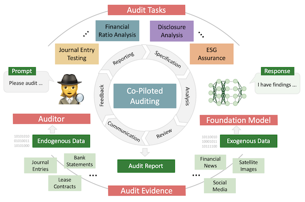

# Artificial Intelligence Co-Piloted Auditing

Welcome to the official GitHub repository for the *Artificial Intelligence Co-Piloted Auditing* research paper. This repository maintains the prompt protocols implemented in our experiments, demonstrating the collaborative auditing tasks accomplished by auditors and foundation models.

## About the Paper

<p align="left">
  
  <br>
  <i>Figure: Co-piloted auditing, wherein human auditors collaborate with foundation AI models to accomplish audit tasks.</i>
</p>

In this study, we propose the concept of artificial intelligence co-piloted auditing, emphasizing the collaborative potential of auditors and foundation models, such as LaMDA, DALL-E, and GPT-4, in the auditing domain. We imagine an audit setup where human auditors' capabilities are enhanced through artificial intelligence, facilitating optimal outcomes across a variety of audit tasks:

- The **foundation model**, with its proficiency in handling extensive non-client specific exogenous data (*e.g.,* financial news, financial reports, satellite imagery), offers a broad knowledge base and multi-tasking capabilities. It discerns patterns, conducts preliminary assessments or projections from large data sets, thereby enriching the auditor's decision-making process.

- The **human auditor**, conversely, applies professional judgment and a deep understanding of client-specific endogenous data (*e.g.,* journal entries, bank statements, contracts) for contextual interpretation and application of widely accepted audit principles, thereby guiding the foundation model's analysis and knowledge application.

In this overarching co-pilot setup, the auditor and the foundation model do not merely act as users and tools; they are collaboratively navigating the audit together in continuous and iterative dialogue. To exemplify the potential of this co-piloted audit paradigm, we illustrate a systematic fine-tuning approach of foundation models using chain-of-thought prompting that enables instruction learning, in-context learning, and sequential reasoning. We demonstrate the potential of co-piloted auditing, by fine-tuning GPT-4 using OpenAI's ChatGPT interface towards three different audit tasks namely financial ratio analysis, text mining, and journal entry testing. 

This work reflects early work-in-progress. We warmly welcome your contributions and feedback! Feel free to suggest your own prompt protocols, raise issues, or submit pull requests. The authors are responsible for the content creation, while GPT-4 (ChatGPT) has been employed in the proofreading.

## Repository Structure

We provide a detailed description of the formulated prompt protocols and the corresponding responses generated by ChatGPT, ensuring reproducibility. This repository encompasses three distinct prompt protocols used in our experiments:

1. Experiment A `Prompt_Protocol_A.md`: Fine-tuning protocol for the GPT-4 model, targeting financial ratio analysis.
2. Experiment B `Prompt_Protocol_B.md`: Fine-tuning protocol for the GPT-4 model, focusing on post-implementation review.
3. Experiment C `Prompt_Protocol_C.md`: Fine-tuning protocol for the GPT-4 model, aiming at detecting anomalies in journal entry data.

Each protocol presents comprehensive instructions for auditors to interact with the foundation model, guiding the ChatGPT interaction from task initiation to completion. We envision this work as an initial step towards the widespread implementation of co-piloted auditing, paving the way for more efficient, accurate, and insightful audit procedures.

## Usage

To utilize these protocols, follow the instructions detailed in each file. They have been designed to guide you through the interaction process with OpenAI's GPT-4 foundation model.

## Citing This Work

If our work contributes to your research, or you find it worthy of citation, please use:

H. Gu, M. Schreyer, K. Moffitt, and M.A. Vasarhelyi, *Artificial Intelligence Co-Piloted Auditing*, Social Science Research Network (SSRN), 2023.

For BibTeX users:

```bibtex
@misc{gu2023artificial,
  title={Artificial Intelligence Co-Piloted Auditing},
  author={Gu, H. and Schreyer, M. and Moffitt, K. and Vasarhelyi, M.A.},
  year={2023},
  howpublished={Social Science Research Network (SSRN)},
  note={Preprint},
  url={URL_of_the_Paper_on_SSRN}
}

## License

This project is licensed under the terms of the MIT license. See the [LICENSE](LICENSE) file for details.
